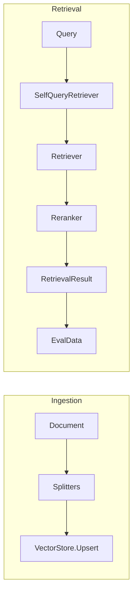

# ragy

[](https://go.dev/)
[](https://opensource.org/licenses/MIT)
[](.)
[](.)

**ragy** is a stateless Go engine for semantic memory and RAG pipelines. It does not hard‑dependency on any LLM: embedding, query rewriting, and context generation are injected via interfaces and callbacks. You keep full control over prompts and providers. The core offers strict contracts (**VectorStore**, **Retriever**, **Splitter**), **Observability** (OpenTelemetry in `ragy/obs`), and **eval‑ready** outputs (`RetrievalResult.EvalData`).

---

## Why ragy

- **100% Stateless & No LLM Dependency** — No built‑in prompts. You wire LLM through interfaces and callbacks.
- **Observability First** — Native OpenTelemetry in `ragy/obs`. Every search, chunk, and context generation is a span.
- **Multi‑Modal & Late Interaction** — **TensorEmbedder** (ColBERT) and **MultimodalEmbedder** (images).
- **GraphRAG Ready** — Native **Node**/ **Edge** types and Neo4j adapter.
- **Smart Retrieval** — HyDE, Contextual Retrieval, Self‑Query, and Ensemble (RRF) for hybrid search (e.g. in Postgres).

---

## Architecture



---

## Installation

```bash
go get github.com/skosovsky/ragy
go get github.com/skosovsky/ragy/adapters/pgvector
```

---

## Quick Start

Minimal flow: split a document, embed chunks, upsert into an in‑memory store, then run a vector search.

```go
package main

import (
	"context"
	"log"

	"github.com/skosovsky/ragy"
	"github.com/skosovsky/ragy/retrievers"
	"github.com/skosovsky/ragy/splitters"
	"github.com/skosovsky/ragy/testutil"
)

func main() {
	ctx := context.Background()
	store := testutil.NewInMemoryVectorStore()
	embedder := testutil.NewMockDenseEmbedder(8)

	doc := ragy.Document{ID: "1", Content: "First section.\n\nSecond section.\n\nThird section."}
	splitter := splitters.NewRecursiveSplitter(splitters.WithChunkSize(50), splitters.WithChunkOverlap(10))

	var chunks []ragy.Document
	for ch, err := range splitter.Split(ctx, doc) {
		if err != nil {
			log.Fatal(err)
		}
		chunks = append(chunks, ch)
	}

	contents := make([]string, len(chunks))
	for i := range chunks {
		contents[i] = chunks[i].Content
	}
	vecs, err := embedder.Embed(ctx, contents)
	if err != nil {
		log.Fatal(err)
	}
	for i := range chunks {
		if chunks[i].Metadata == nil {
			chunks[i].Metadata = make(map[string]any)
		}
		chunks[i].Metadata[testutil.EmbeddingKey] = vecs[i]
	}
	if err := store.Upsert(ctx, chunks); err != nil {
		log.Fatal(err)
	}

	retriever := retrievers.NewBaseVectorRetriever(embedder, store)
	res, err := retriever.Retrieve(ctx, ragy.SearchRequest{Query: "section", Limit: 5})
	if err != nil {
		log.Fatal(err)
	}
	for _, d := range res.Documents {
		log.Println(d.ID, d.Content)
	}
}
```

---

## Advanced

**Contextual Retrieval** — wrap any splitter and enrich chunks with LLM-generated context (worker pool, order preserved):

```go
inner := splitters.NewRecursiveSplitter(splitters.WithChunkSize(500))
cs := splitters.NewContextualSplitter(inner, myContextualizer, splitters.WithContextualConcurrency(5))
```

**Self-Query & AST filters** — build filters safely and merge with RBAC (e.g. `filter.All(req.Filter, parsed.Filter)`):

```go
f := filter.All(filter.Equal("tenant", 1), filter.Greater("age", 18))
```

**Observability** — wrap retrievers and stores with OpenTelemetry:

```go
traced := obs.NewTracedRetriever(retriever, tracer)
```

**Semantic Caching** — beyond retrieval, ragy provides a `SemanticCache` interface. It stores expensive LLM responses in a vector store (e.g. pgvector) and returns them for semantically similar queries (e.g. "How do I reset my password?" and "I forgot my password, what do I do?"), saving tokens and response time. Use the `ragy/cache` package (import `github.com/skosovsky/ragy/cache`). Cache entries are isolated by metadata `_cache_type=semantic` so the same store can hold both cache and knowledge-base documents. Calling `Set` again for the same exact query overwrites the previous response (document ID is deterministic from the query).

```go
sc := cache.NewVectorCache(store, embedder)
resp, hit, err := sc.Get(ctx, "reset password", 0.95)
// On miss: hit is false, err is nil. Use hit to decide whether to call LLM.
```

---

## Ecosystem

ragy is designed to work with:

- **metry** — telemetry hub
- **toolsy** — tools for agents
- **flowy** — agent orchestration

---

## Contributing

See the repository for contribution guidelines.

## License

MIT
